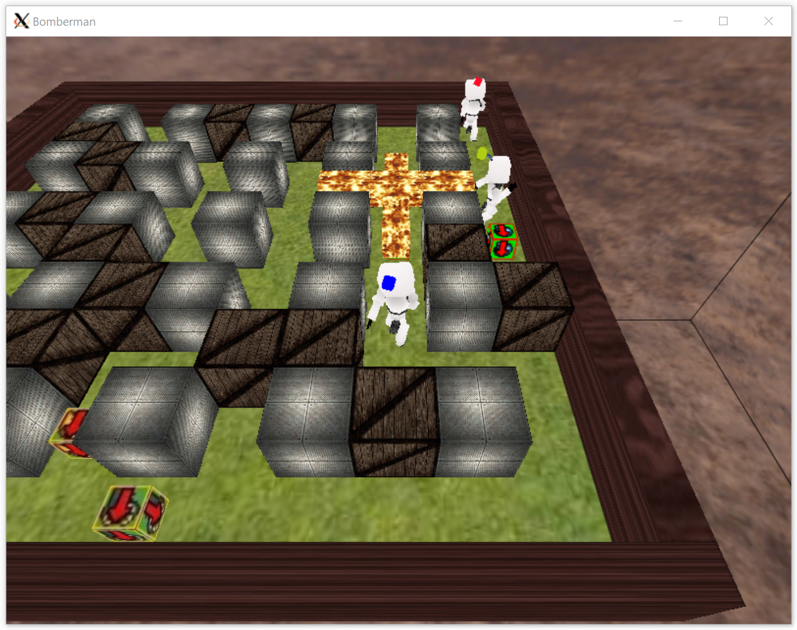
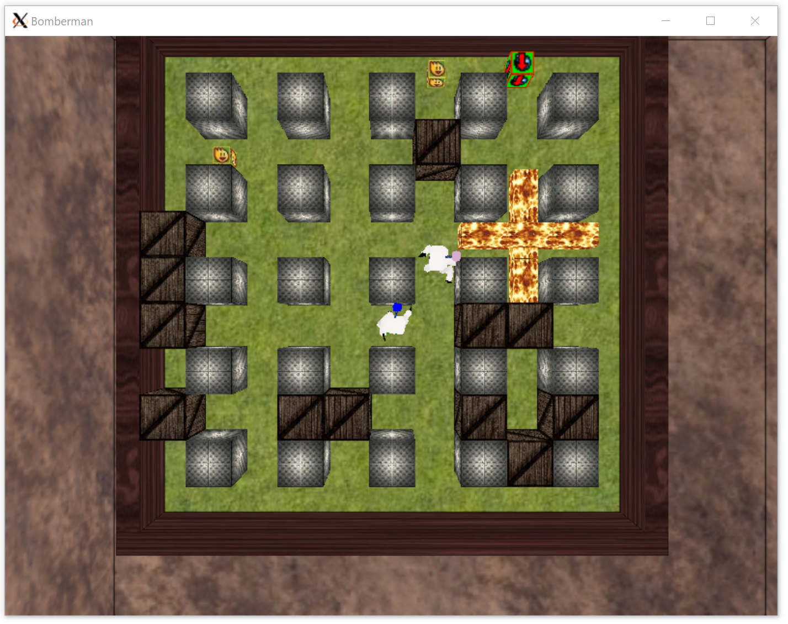
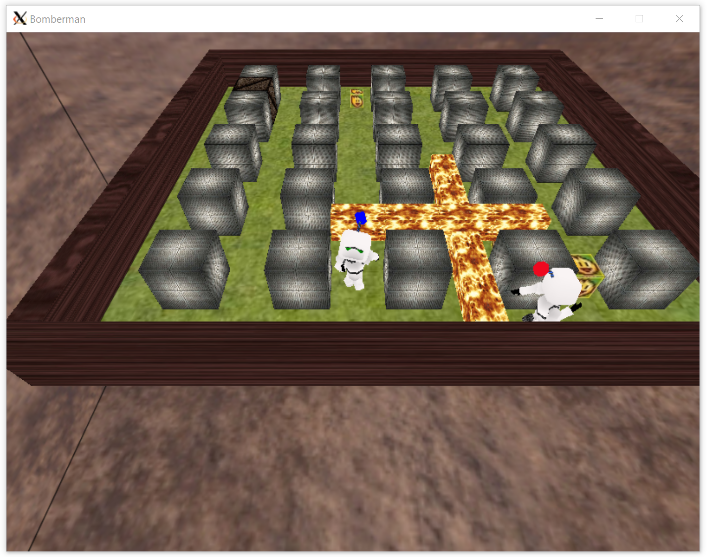
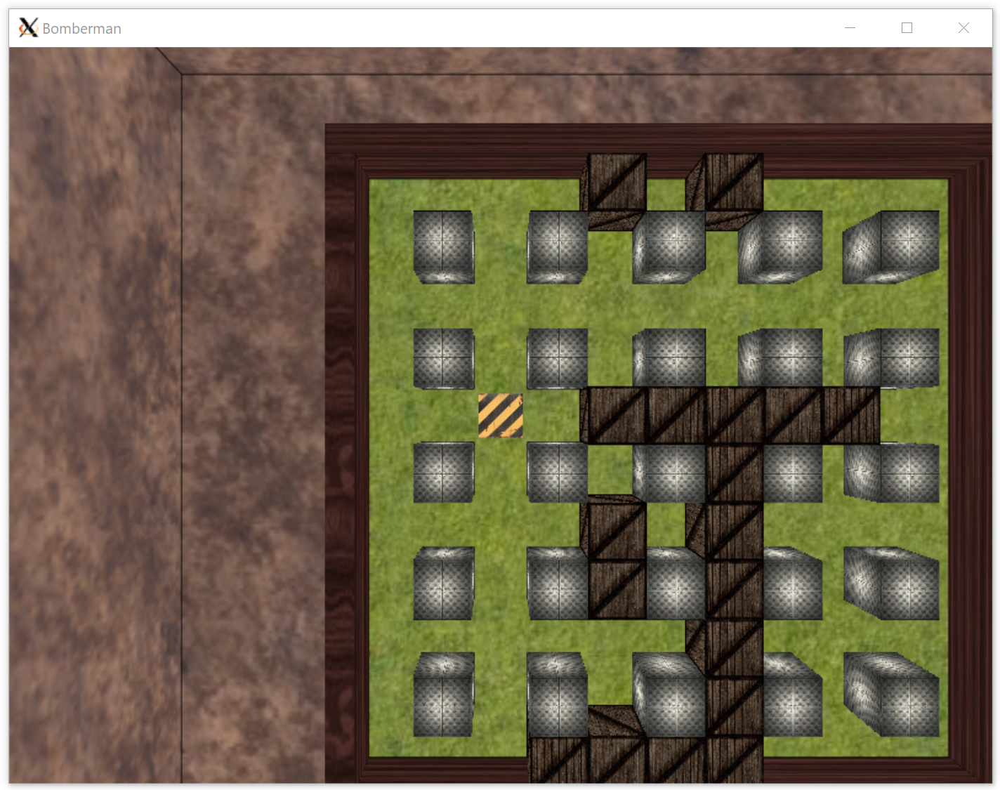
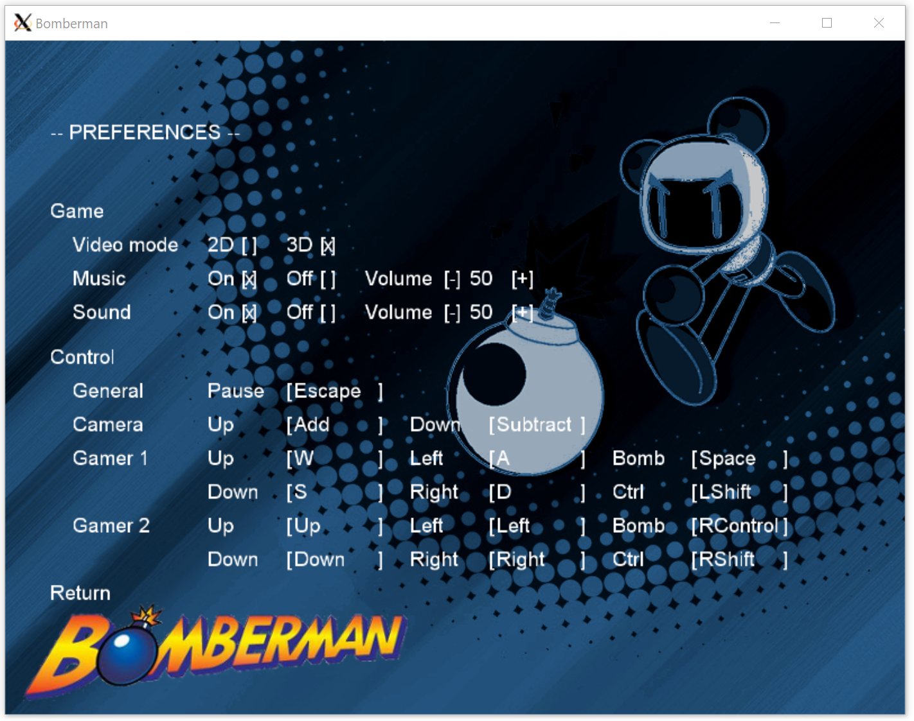

# Bomberman Game [](https://travis-ci.org/kortescode/Bomberman-Game)

Bomberman Game is a C++ executable. It is based on the [Bomberman video game](https://en.wikipedia.org/wiki/Bomberman) owned by [Konami](https://www.konami.com).



## Requirements

Building the Bomberman Game executable requires the following tools:
- X.org graphic system (see [www.x.org](https://www.x.org/wiki/))
```bash
sudo apt-get install xorg
```
- OpenGL libraries (see [www.opengl.org](https://www.opengl.org/))
```bash
sudo apt-get install libgl1-mesa-dev mesa-common-dev libglu1-mesa-dev freeglut3-dev
```
- Simple and Fast Multimedia Library (see [www.sfml-dev.org](https://www.sfml-dev.org/))
```bash
sudo apt-get install libsfml-dev
```
- Gnome Lib XML 2 (see [www.xmlsoft.org](http://xmlsoft.org/))
```bash
sudo apt-get install libxml2-dev
```

## Compilation

To build the executable, use:
```bash
make all
```

## Usage

To launch the game use:
```bash
./bomberman
```

### Games

 

#### Adventure Game

- New game: launch a new arcade game
- Load game: load an arcade game saved previously

#### Free Game

- Default game: launch a new free game with the default configuration
- Configurable game: configure the map width, map height, gamers number, enemies number and box percentage before launching a new free game
- Random game: launch a new free game with a random configuration
- Load map: launch a new free game with a map saved previously

### Map Editor



Configure the map width and map height before launching a new map editor.

### Scores

The scores of the Adventure Game and Free Game are displayed here.

### Preferences



- Game: configure the video mode (2D or 3D), the music and the sound preferences
- Control: configure the keys for General, Camera, Gamer1 and Gamer2

## License

Distributed under the [Apache License, Version 2.0](http://www.apache.org/licenses/). See [`LICENSE`](LICENSE) for more information.
